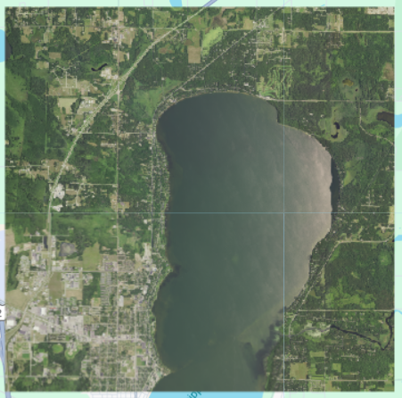
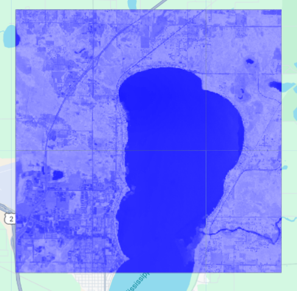
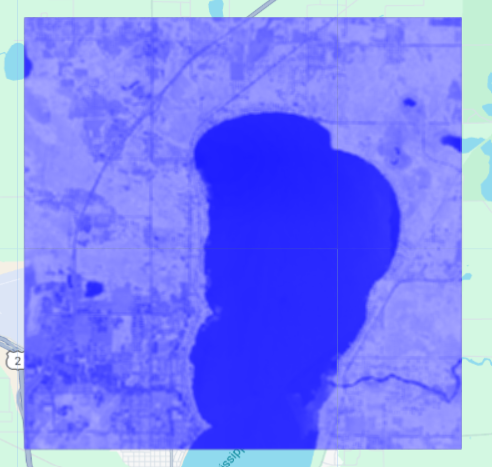
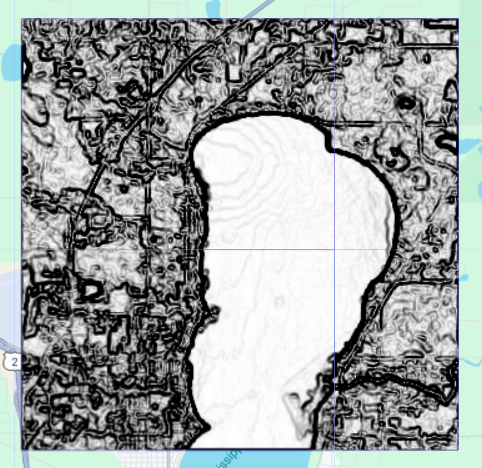
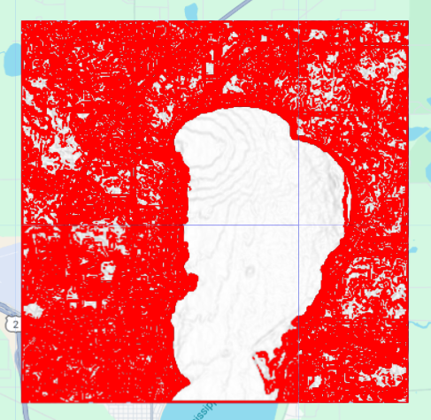

This report was submitted as coursework for the GMT441 course at Hacettepe University.
The content represents the author's individual academic work. Please do not reuse without citation.
Water Body Extraction & Edge Detection with NDWI

##Objective
To extract water bodies and delineate their boundaries using:
- NDWI (Normalized Difference Water Index)
- Edge-preserving smoothing
- Sobel-based gradient magnitude calculation
- Thresholding to detect water-land edges

## Data
- **Source**: NAIP 2019 Imagery
- **Bands**: Red, Green, Blue, NIR
- **Spatial Resolution**: 1 meter
- **Study Area**: Minnesota, USA

##Workflow
1. Clipping NAIP imagery to study area
2. Calculating NDWI using Green and NIR bands
3. Applying 3×3 smoothing to NDWI
4. Computing Sobel gradients (horizontal & vertical)
5. Deriving gradient magnitude image
6. Applying a threshold (0.1) to extract edges

##Files
- `report.pdf`: Full project report
- `outputs/`: All intermediate and final result figures

##Highlights
- NDWI enhanced water detection
- Gradient magnitude clarified boundaries
- Thresholding successfully isolated water-land edges
- Urban-vegetation transitions introduced minor noise (noted in Discussion)

  ### Sample Outputs

#### Pre-Fire RGB Image  

#### NDWI Index Result  

#### Smoothed NDWI  

#### Sobel Gradient Magnitude  

#### Thresholded Edge Detection  

##Resources
- [NAIP Dataset Info](https://developers.google.com/earth-engine/datasets/catalog/USDA_NAIP_DOQQ)
- [GEE Script (optional)](https://code.earthengine.google.com/9529314a6615043f943ce2e28ef77543)
- The full written report is available upon request.
Please contact the author for access. Only the core outputs and methodology are publicly displayed here.
