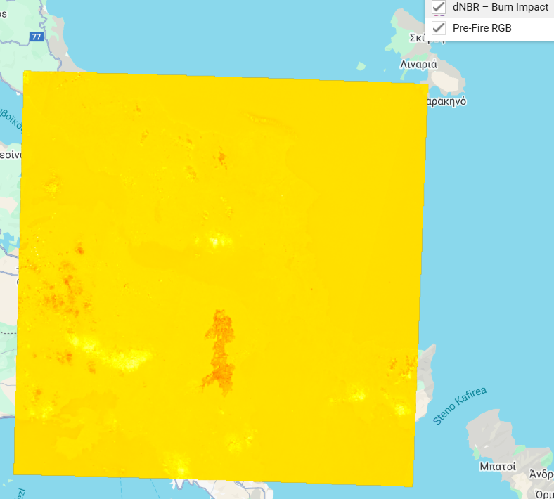
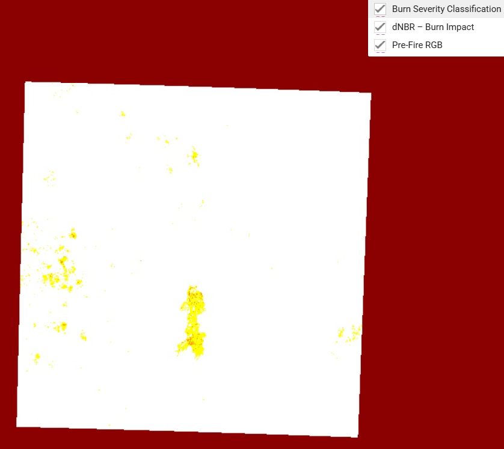

> This report was submitted as coursework for the GMT441 course at Hacettepe University.  
> The content represents the author's individual academic work. Please do not reuse without citation.
Wildfire Damage Assessment in Attica, Greece
##Objective
To assess wildfire-affected areas and burn severity using:
- Sentinel-2 (optical) for NBR and delta NBR (dNBR)
- Sentinel-1 (SAR) for backscatter difference (dVV)
- Burn severity classification
- Machine learning (Random Forest) classification

## Data
- **Sentinel-2 Level-2A**: NIR and SWIR bands (for NBR, dNBR)
- **Sentinel-1 VV**: for backscatter difference
- **Study Area**: Attica, Greece (fire event on August 11, 2024)
- **Reference**: Copernicus EMSR746 Delineation Monitoring 2 product

##Workflow Summary
1. Compute NBR for pre- and post-fire images → dNBR calculation
2. Compute Sentinel-1 backscatter difference (dVV)
3. Classify burn severity zones from dNBR
4. Perform supervised Random Forest classification with ground-truth polygons
5. Validate with Copernicus EMS data (confusion matrix, Kappa)
6. Area calculations by severity classes

##Results
- Total burned area (dNBR): **2,282.05 ha**
- Random Forest classification overall accuracy: **91.2%**
- dNBR severity classification accuracy: **66.3%**, Kappa = 0.022
- SAR backscatter revealed structural loss in central zone

##Files
- `report3.pdf`: Full project report
- `outputs/`: All maps and classification results

## GEE Script
[👉 Run the code on Google Earth Engine](https://code.earthengine.google.com/0c0639819e8f2eaf075f46541e1dde98)

### Sample Outputs

#### dNBR – Burn Severity (continuous)

#### Classified Burn Severity (4 classes)

#### SAR VV Difference Map

#### Thresholded SAR Change Mask

#### Unsupervised K-means Classification

#### Random Forest – Training Polygons

##References
- Chuvieco, E., et al. (2006). *Use of a radiative transfer model to simulate the postfire spectral response to burn severity*. Remote Sensing of Environment, 103(3), 312–325. https://doi.org/10.1016/j.rse.2005.08.013  
- Copernicus EMS (2024). *Wildfire rapid mapping activation EMSR746*. https://emergency.copernicus.eu/mapping/list-of-components/EMSR746  
- Google Earth Engine (2024). *https://earthengine.google.com/*  
- López-Amoedo, P., et al. (2021). *Multi-temporal Sentinel-2 data analysis for smallholding forest cut control*. Remote Sensing, 13(12), 2983. https://doi.org/10.3390/rs13122983  
- Masshadi, M., & Alganci, U. (2021). *Forest burn scar and severity analysis via free satellite images and machine learning*. Int. J. of Env. and Geoinformatics, 8(3), 354–364. https://doi.org/10.30897/ijegeo.879669  
- Smith, A. M. S., et al. (2005). *Retrospective fire severity estimation in savannahs*. Remote Sensing of Environment, 97(1), 92–115. https://doi.org/10.1016/j.rse.2005.04.014  
- Tariq, A., et al. (2021). *SAR-based forest fire analysis in Pakistan*. Remote Sensing, 13(12), 2386. https://doi.org/10.3390/rs13122386  
- Veraverbeke, S., et al. (2014). *An alternative index for rapid fire severity assessment*. Remote Sensing of Environment, 123, 234–245. https://doi.org/10.1016/j.rse.2012.03.024

- The full written report is available upon request.  
Please contact the author for access. Only the core outputs and methodology are publicly displayed here.

