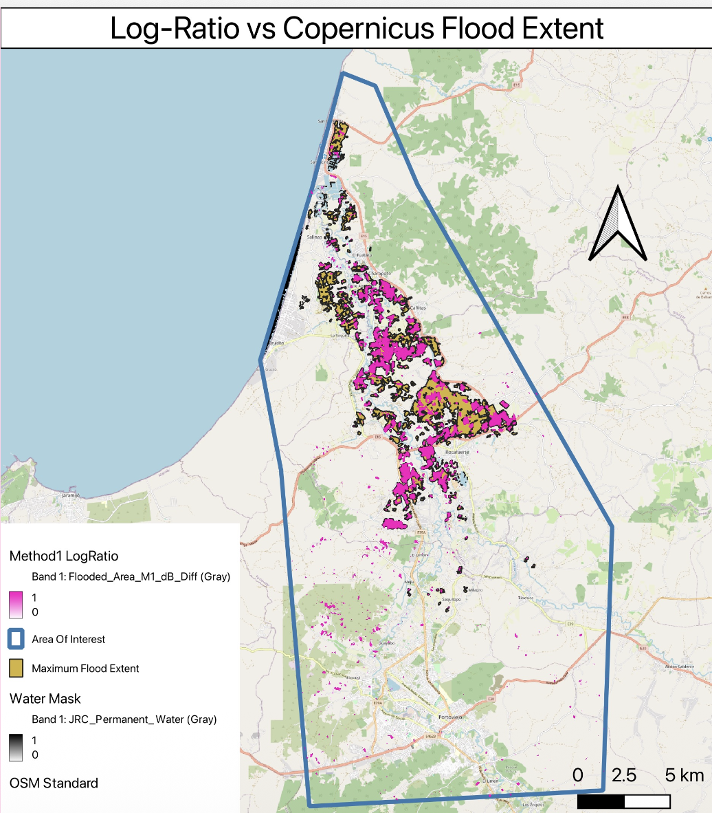

# Remote Sensing & Earth Observation Projects

> **About:** This repository is a comprehensive collection of my remote sensing projects completed during my senior year. It includes both advanced R&D studies (Showcase) and academic coursework implementations.

---

## FEATURED PROJECT: Flood Extent Mapping with SAR
**Status:** `Advanced Study / Showcase`

While optical imagery often fails during storm events due to clouds, this project leverages **Sentinel-1 Synthetic Aperture Radar (SAR)** to map flood extent regardless of weather conditions.

### Key Methodology
* **Data:** Sentinel-1 GRD (IW Mode).
* **Technique:** Change detection using backscatter intensity differences (Pre-Event vs. Post-Event).
* **Algorithm:** Applied **Speckle Filtering** (Refined Lee) and **Otsu’s Thresholding** for automatic water classification on GEE.

### Result Visualization
*Flood extent map showing the Log-Ratio Method's success  while comparising with the Copernicus Flood Data*

---

## Academic Coursework Projects

Below are the implementations from my university curriculum, demonstrating fundamental remote sensing techniques.

| Project Folder | Description | Key Tech |
| :--- | :--- | :--- |
| **[HW3_Wildfire_Assessment](./HW3_Wildfire_Assessment)** | Post-fire severity analysis using dNBR indices. | `Landsat-8`, `dNBR` |
| **[HW2_NDWI_EdgeDetection](./HW2_NDWI_EdgeDetection)** | Water body delineation using NDWI and Edge Detection. | `Sentinel-2`, `Canny` |
| **[HW1_Sentinel2_Stacking](./HW1_Sentinel2_Stacking)** | Multispectral band stacking and composite generation. | `JavaScript` |

---

## Contact
**Gülüzar Yiğit** - Geomatics Engineering Student @ Hacettepe University
